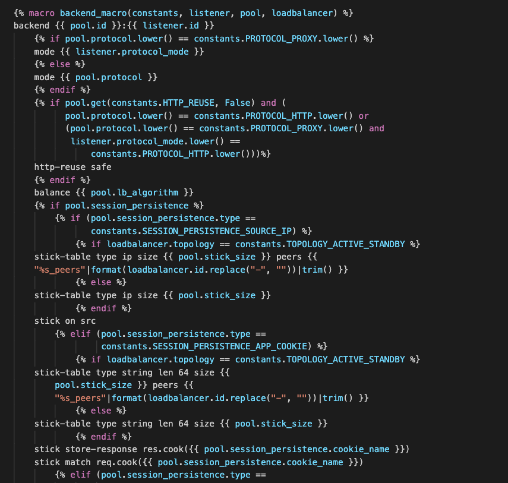
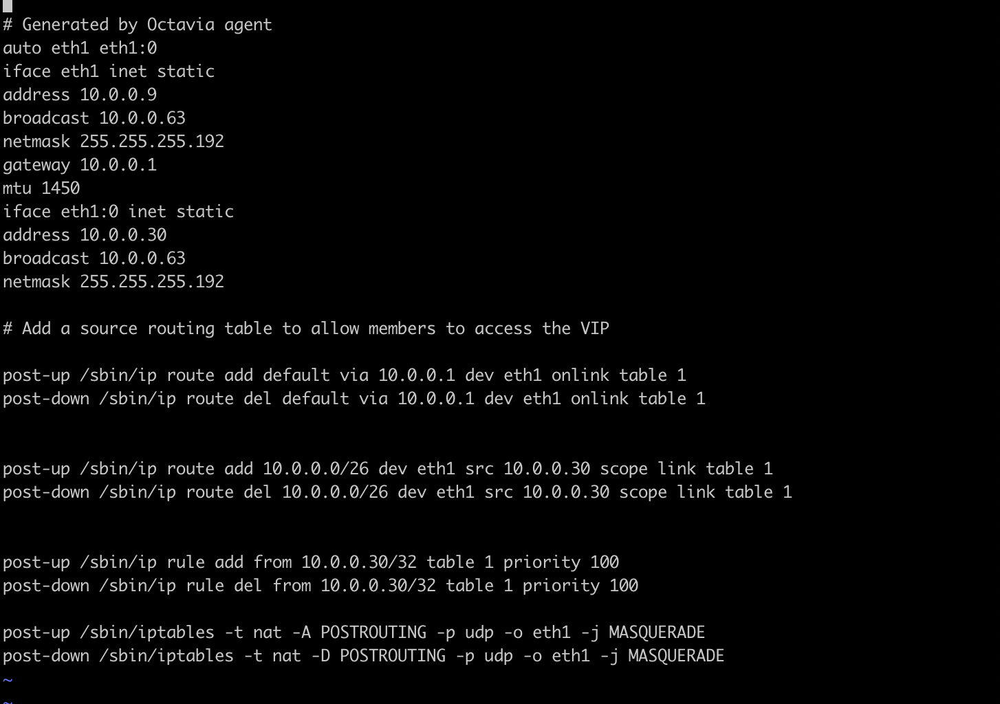
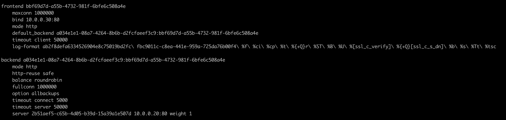
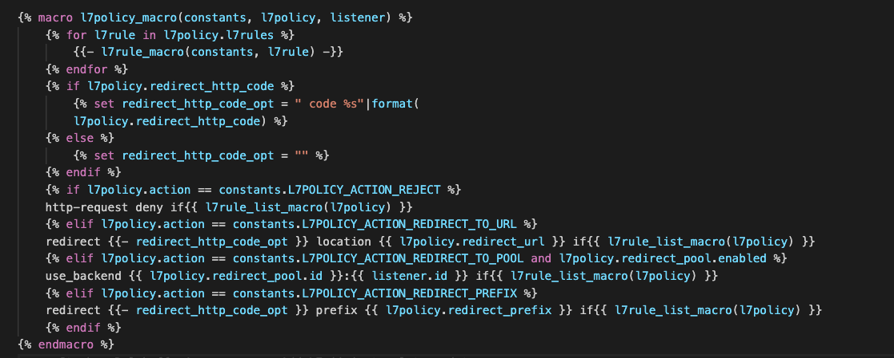
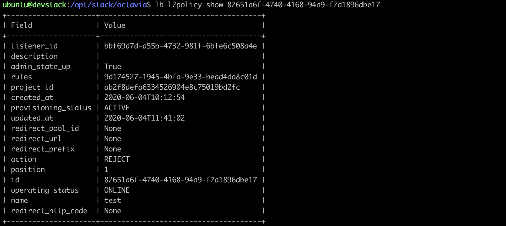
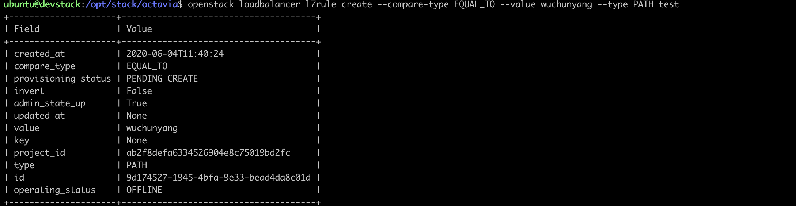
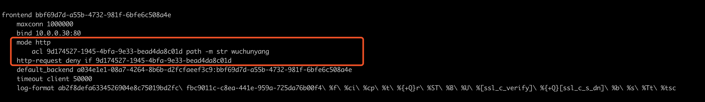
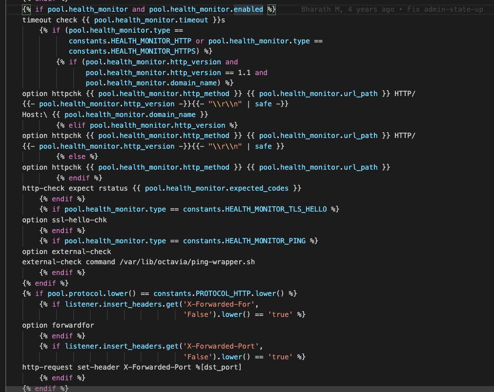
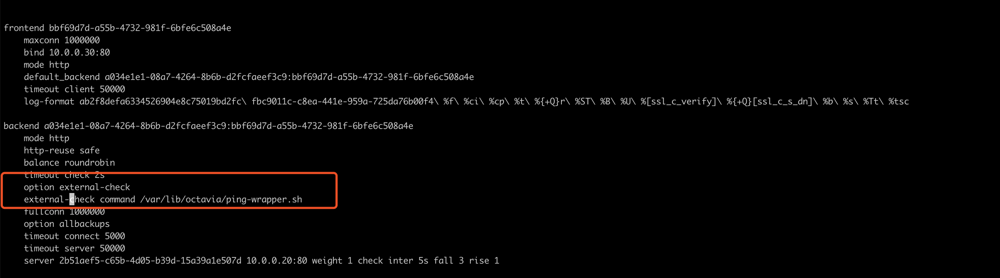
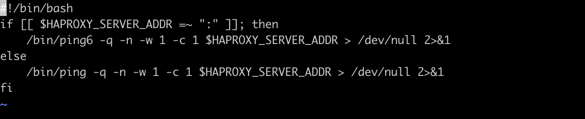

# octavia的组件介绍

octavia 是一个开源的openstack的lb解决方案

## octavia-api

1. 负责request参数，以及创建数据库

## octavia-worker

1. 负责实际干活

## octavia-hm

负责检查amphora是否失败，失败了的话，就执行failover任务

## Housekeeping Manage

删除数据库中多余的记录，管理多余的pool和certificate的记录


# octavia 创建 loadbalance

## octavia-api过程

1. 入口函数

octavia/api/v2/controllers/load_balancer.py中的 def post函数

2. 步骤

    - 验证request中的project id
    - 验证vip，flavor，availability等
    - 加载driver，默认是amphora
    - 检查quota
    - 检查网络是否是allowed（配置文件中）的网络列表中
    - 数据库插入loadbalance和vip表。
    - 调用默认的driver来创建vip_port
        - 调用amphora的drvier来创建vip
        - 这一步amphora的driver实际会调用neutron的createport方法，但是并不是所有的driver都会创建网络的
        - 返回这个vip的相关信息字典
    - 更新VIP表里面的其他字段，比如port-id等
    - 判断api的body里面是否传了listener和pool等信息，如果有进一步处理
    - 调用amphora的driver来创建lb
        - amphora的driver创建lb，通过cast远程调用其他的节点上的create_load_balancer方法 
    - 保存数据库，返回api一个loadbalancer的对象信息。

## octavia worker

1. 入口函数

`octavia/controller/worker/v1/controller_worker.py:create_load_balancer`函数

2. 创建步骤

    - 从数据库loadbalancer表中拿到需要创建的lb信息
    - 创建store，这个是taskflow里面传递到tasks的参数
    - 创建flow（核心代码就在这里）
        - 代码入口`octavia/controller/worker/v1/flows/load_balancer_flows.py:get_create_load_balancer_flow`
        - 创建一个名为`octavia-create-loadbalancer-flow`的linear_flow，linear_flow就是流水flow，也就是顺序执行tasks。
        - 第一个任务从lb数据库里面拿到所有信息，返回给其他的tasks使用
        - 通过network drvier来allocateVIP，这一步会调用neutron的client来创建port，这一步如果api端创建过了的话，就直接返回了，实际上API调用的amphora driver创建的网络，并不是所有的drvier都会创建网络。，
        - 分配之后更新vip的数据库中的信息
        - 判断一下是否需要创建安全组，如果需要的话，调用neutron的client来创建安全组，创建完成后，更新其中的rule规则，最后把port加入到这个安全组中
        - 获取subnet的子网信息。
        - 判断topology是ACTIVE_STANDBY还是TOPOLOGY_SINGLE
        - 接下来以topology_single为例            
    - 创建 topoloy single的tasks
        - 代码入口`octavia/controller/worker/v1/flows/load_balancer_flows.py +78`
        - 继续创建一个graph_flow，graph_flow是有依赖关系的flow
        - 从amp数据库中找状态是ready，并且load_banlancer_id 为None的虚拟机，如果找到了，就把状态改成allocate并且把load_banlancer_id改成当前的lb_id,并且返回amp.id
        - 如果没有找到这样的虚拟机，则返回一个none
        - 接下来是graph的link用法

            ```python
            Add them to the graph flow
            amp_for_lb_flow.add(allocate_and_associate_amp,
            map_lb_to_amp, create_amp)
            # Setup the decider for the path if we can map an amphora
            amp_for_lb_flow.link(allocate_and_associate_amp, map_lb_to_amp,
            decider=self._allocate_amp_to_lb_decider,
            decider_depth='flow')
            # Setup the decider for the path if we can't map an amphora
            llocate_and_associate_amp, create_amp,
            decider=self._create_new_amp_for_lb_decider,
            decider_depth='flow')
            ```
        - allocate_and_associate_amp就是上一个任务（寻找空的amphora虚拟机，返回none或者amp的id）
        - map_lb_to_amp 就是当decider为true的时候执行，decider为一个可调用函数，并且需要接受一个history的变量，这个变量是一个字典，key是task的名字，而value是allocate_and_associate_amp的返回值，decider_depth是影响范围，可选flow，all等，这里就是allocate_and_associate_amp的任务如果返回了ampid，那么就执行map_lb_to_amp的任务，否则返回的是None，就执行create_amp的任务。
        - 下面查看create_amp的tasks，create_amp又定义了一堆的task，查看几个重点，下面是一个line flow
            1. 首先判断是否是amphora_haproxy_rest_driver driver
            1. 如果是的话，先生成PEM证书，目前只支持local的x509本地证书生成。（证书相关内容，暂时没有深入细看）
            1. 之后amphora的表中更新cert_expiration字段
            1. 判断是否需要创建亲和虚拟机
            1. 创建虚拟机（网络从配置文件amp_boot_network_list中拿，user_data_config_drive从配置文件中拿，key_name从配置文件中拿，topology从配置文件里拿，flavor，如果传进来的话就用这个flavor，没有的话，配置文件里拿，这个支持了自定义的flavor，处理availability_zone，从配置文件里找一下build_rate_limit，是否为-1，如果不是-1的话，直接使用默认的40次，接下来处理config driver中的/etc/octavia/amphora-agent.conf文件，template是在`octavia/amphorae/backends/agent/templates/amphora_agent_conf.template`，这个配置文件用到了刚才生成的证书，之后处理`/etc/rsyslog.d/10-rsyslog.conf`这个配置文件，全部处理好了之后，开始创建虚拟机。）

                ```python
                compute_id = self.compute.build(
                    name="amphora-" + amphora_id,
                    amphora_flavor=amp_compute_flavor,
                    image_id=CONF.controller_worker.    amp_image_id,
                    image_tag=CONF.controller_worker.   amp_image_tag,
                    image_owner=CONF.controller_worker. amp_image_owner_id,
                    key_name=key_name,
                    sec_groups=CONF.controller_worker.  amp_secgroup_list,
                    network_ids=network_ids,
                    port_ids=[port.id for port in ports],
                    config_drive_files=config_drive_files,
                    user_data=user_data,
                    server_group_id=server_group_id,
                    availability_zone=amp_availability_zone)
                ```
            - 如果不是amphora_haproxy_rest_driver的话
                1. 上面的步骤中，就不需要创建haproxy pem和更新数据库，其他的步骤一样。
            - 创建完成后开始更新数据库
                1. 更新amphora表中的compute id
                1. 更新amphora表中的状态为booting
                1. 等待instance 的状态为running
                1. 用instance的信息，更新amphora表中的信息，比如network_ip，image id，compute_flavor等，并不会更新vrrp相关的信息，应该是topology 为SINGLE的缘故吧
                1. 等待虚拟机的服务起来，通过api去请求，相当于执行` curl https://172.16.0.140:9443/ -k --cert /etc/octavia/certs/private/client.cert-and-key.pem`来获取api_version用来判断是否正常。
                1. 调用finalize_amphora来完成驱动的工作，实际上这一步什么也没做，直接pass掉，是用来解决配置listener之前的所有的配置。
                1. 更新amphora数据库，关联的lb_id，compute_id，amphora_id
                1. reload amphora的数据，并且返回出去（重新获取amphora中的对象）
                1. 最后把amphora表中的role改成standalone

## octavia images

1. 虚拟机的镜像制作
    pass
2. ampora的reset api接口

    `octavia/amphorae/backends/agent/api_server/server.py`


# octavia 创建 listener

## octavia-api 的工作

1. 入口函数如下

    `octavia/api/v2/controllers/listener.py:post方法`
1. 创建步骤
    1. 拿到请求的信息，或者project id，lb id等
    1. 验证RBAC，查看是否有权限
    1. 加载amphora的drvier
    1. check quota
    1. 处理listener的字典，删掉一些敏感信息。处理一下字典
    1. 查看传进来的是否有default_pool_id字段，如果有需要验证listener和pool的信息是否匹配，比如：协议等。
    1. 检查lb是否是immutable状态。（比如PENDING_CREATE状态就是不可改变的），是的话，直接抛异常，如果不是的话，把lb的状态改成PENDING_UPDATE，但是还没有保存到数据库里
    1. 检查listener的protocol是否支持各种协议，比如TLS，ca等等，在这个函数里检查`octavia/api/v2/controllers/listener.py：_validate_create_listener`
    1. 调用driver去create linstener，这一步rpc调用到worker去创建
    1. 写入到数据库，lb的状态就被更改了。

## octavia-work 的工作

### 入口函数

    `octavia/controller/worker/v1/controller_worker.py：create_listener`

### 流程
1. 从数据库中根据listenerid拿到listener db对象
1. 从listener对象中拿到lb对象，然后在lb中拿到所有listeners对象
1. 把listeners传到flow中去，开始创建flow
    1. flow的执行流程如下
    1. 首先创建一个回滚任务，后面无论啥失败了，都是制lb为active状态，并且设置listener为error状态
    1. 执行amphora的update函数，这个函数会去更新置，首先在所有的loadbalancer下面的amphora虚机中，不是delete的更新信息，更新的函数如`octavia/amphorae/drivers/haproxyrest_api_driver.py`
        ```python
        def update_amphora_listeners(self,loadbalancer, amphoratimeout_dict=None):
        #接受两个参数，一个是lb，一个是amphora
        检查一下lb的listener是否唯恐，以及amphor是否为空，或者状态是DELETED。
        ```
        1. 检查完成后获取haproxy的version，通过前创建lb的方法去获取version，绑定到objec对象上，然后切割，比如1.6，切割成[1，6]，际上这一步就是去就是执行如下的api请求`curlhttps://172.16.0.95:9443/1.0/info -k--cert /etc/octavia/certs/privateclient.cert-and-key.pem` ip地址amphora的地址，拿到的信息如下。本例最终返的是['1', '8']
            ```json
            {"hostname":"amphora-8d8bc921-84d-4487-9023-bc5b24664bbc""haproxy_version":"1.8.8-1ubuntu010","api_version":"1.0""keepalived_version":"1:1.39-1ubuntu0.18.04.2""ipvsadm_version":"1:128-3ubuntu0.18.04.1"}
            ```
        1. haproxy的verison和api_version都拿后，开始更新listener。
        1. 如果是listener的协议是udp的话，那么开渲染配置文件模版，template的目录在`octavia/common/jinja/lvs/templateskeepalivedlvs.cfg.j2`下，拿到配置的文后，调用amphora的接口来上传配置文件，上传api路由为：PUT方法 `{ip:port/apiversion}listeners/{amphora_id}/{listener_id}udp_listener'`上传结束后，在reloadlistener，reload调用的的接口如下,其action的值是reload`'loadbalancer{object_id}/{action}'`，最终配置文件会发到amphora的虚拟机中的`/var/liboctavia/lvs`目录下，使用keepalive ipvs做UDP的转发代理
        1. 其他的比如HTTP或者TCP的话，则渲haproxy的配置文件，模版在`octavia/commonjinja/haproxy/combined_listenerstemplates/haproxy.cfg.j2`是这个，渲染成之后，把config配置通过put的方式，上传amphora的虚拟机中,请求的api`'loadbalancer/{amphora_id}{loadbalancer_id}/haproxy'`，数据通data的参数传输进去，之后reload，配置文件这一步其实是通过api，修改了amphorahaproxy配置文件，这个配置文件在`/var/liboctaviafbc9011c-c8ea-441e-959a-725da76b00f4haproxy.cfg`里面，这个中间的id是lb的id。
        这里面配置端口转发，目前这里只是创建了监听口，实际上并没有转发机器，例如：

            ```conf
            frontendbbf69d7d-a55b-4732-981f-6bfe6c5084e
                maxconn 1000000
                bind 10.0.0.30:80
                mode http
                timeout client 50000
            frontendd3d971bf-c235-4f8a-9164-8a5bb056bf0
                maxconn 1000000
                bind 10.0.0.30:8080
                mode tcp
                timeout client50000                
            ```
    1. update执行完成后，开始更新VIP，调用networ的driver去更新securitygroup中的rule中的规则把listener中加入的端口号，添加到rule中。
    1. 最后把lb的数据库状态改成ACITVIE，并且把所有listener也改成ACTIVE
1. 至此run创建的flow，一个LB listener就创建成功了。

# octavia 创建一个pool

## octavia-api的工作

1. 代码入口

    `octavia/api/v2/controllers/pool.py:post()`
1. 执行步骤
    1. 拿到api那边传过来的pool字典
    1. 判断pool的protocol是否是UDP，如果是的话，判断是否传了一些会话保持的参数，这个UDP可能不支持。
    1. 判断pool带过来的是lb的id，还是listener id。并且lb的优先级比较高
    1. 通过pool指定的listener或者lb，拿到lb的project id和driver，也就是amphora，之后验证RBAC
    1. 验证一下会话保持
    1. 加载amphora的driver
    1. 检查quota
    1. 如果传过来的是listener，那么检查一下listener是否有默认的id
    1. 检查lb和listener的状态，是否是一些pending状态
    1. 创建pool的db对象
    1. 调用drvier的rpc来创建任务
    1. 写入数据库

## octavia-worker的工作

代码入口`octavia/controller/worker/v1/controller_worker.py:create_pool(self, pool_id)`函数

## 步骤

1. 数据库中取pool的相关信息
1. 取listener和lb的信息
1. 创建flow，核心代码在里实现
    1. 创建一个回滚任务，用来重置pool的状态为error，并且把lb和listener的全部改成active，只有在后面创建失败的时候才会执行这一步
    1. 设置pool的db状态为pending create，如果执行失败则改成error状态
    1. 更新listener，执行listener的update函数，这个函数和创建listener的一样，只是会重新渲染模版，这样的做法就是，以后update也只是调用这一个函数，保持幂等性，调用的是put接口。
    1. 这种listener的pool对应的代码如下

        ```
        octavia/common/jinja/haproxy/combined_listeners/templates/macros.j2:backend_macro
        ```
        
    1. 最终还是会下发到haproxy的配置文件中
1. 运行flow
1. 最后发现pool对应的就是haproxy的一个backend

# octavia 创建一个member

## octavia-api的工作

1. 代码入口`octavia/api/v2/controllers/member.py:post(self, member_)`

### 代码流程

1. 拿到member的dict，然后验证ip是否是保留的，通过配置文件里的reserved ip 字段来判断
1. 验证member的subnet，如果传入的话，就从neutron里面查一下，看有没有
1. 从请求中拿到pool，然后获取到db对象
1. 之后获取proejct和provider来验证RBAC
1. 接下来检查一下lb，listener的状态，然后创建member的db对象。
1. 调用driver去创建member，最后保存数据库。
1. 最后返回给api一个数据库状态的东西

## octavia-worker的工作

### 代码入口

`octavia/controller/worker/v1/controller_worker.py:create_member(self, member_id):`

### 代码流程

1. 从数据库中拿到member对象
1. 之后从member中拿到pool，从pool里拿到listener，从listener中拿到lb
1. 创建flow来完成工作
    1. 第一个task还是用来执行回滚的任务，修改member为error，其他pool,listener,lb为active
    1. 更新member的状态为pending create
    1. 处理amphora上的虚拟机接口，哪些需要删除，哪些需要根据要求添加。(这里看起来是支持别的子网的虚拟机？也就是创建member的时候指定别的子网)，最后返回haproxy需要添加的接口
    1. 完成调用amphora的post接口‘plug/network’路径，之后把上一步的返回的接口信息，作为body传过去。
    1. amphora收到请求后，直接处理hander，代码路径

        ```python
        octavia/amphorae/backends/agent/api_server/plug.py:plug_network方法
        ```
    1. 首先在namespace中查看网络接口是否已经存在了。
    1. 根据mac查找到网口的名字
    1. 然后配置网口的配置文件，比如ip和mtu，写在namespace中，配置文件如下:
    

    1. 处理完接口之后，直接更新haproxy的配置文件，也就是backend里面的配置，最终配置文件如下。
    
1. 执行flow

# octavia 创建一个l7polciy

## octavia-api

1. 代码入口

    `octavia/api/v2/controllers/l7policy.py:post()函数`
1. 依旧是拿到l7policy的request对象
1. 验证redirect_pool_id是否正确
1. 拿到linstener，拿到lb，验证RBAC
1. 加载amphora的driver
1. 检查quota，检查polciy的dict，检查lb和listener状态
1. 创建db对象
1. 调用rpc driver去创建l7policy
1. 保存数据库
1. 返回给api前端

## octavia-worker的工作

1. 从数据库中拿到db对象
1. 根据db，查询到listener，lb，然后传到engins的store中去执行。
1. 创建flow，并且添加任务
    1. 失败时候的回滚任务，修改l7pocicy为error状态，listener，lb为active状态。
    1. 修改l7policy的状态为pending create
    1. 调用amphora 的update接口更新l7polciy，这个传了一个listener id，然后调用update接口，最终还是直接看渲染的haproxy的文件。代码文件如下。

        ```
        octavia/common/jinja/haproxy/combined_listeners/templates/macros.j2
        ```
        1. 代码如下
        
        1. macors中的l7policy_macro模板，用来生成配置文件，l7policy需要和rule配合使用。执行了create policy和rule之后，结果如下。
        
        

        1. 修改的配置项如下
        
    1. 设置数据库中l7policy为active
    1. 设置listener和lb的状态为active
1. 执行flow

# octavia 创建一个l7rule

l7rule的创建几乎和l7policy一模一样，代码结构相同，以及调用了同一个amphora的update接口。

# octavia 创建一个healthmonitor

healthmonitor的资源需要和pool关联

## octavia的api处理

1. 拿到request请求
1. 验证是否允许不允许ping检查，但又设置了ping
1. 拿到pool信息，project id，provder，然后验证pool的协议和hm的协议是否正确，之后在验证RBAC
1. 加载driver，验证lb和listener状态是否正常
1. 调用dirver create hm，
1. 最后写入数据库

## octavia的worker处理

1. 从数据库中拿到DB对象
1. 通过hm对象拿到pool，pool拿到listeners，lb，关联pool
1. 创建flow，添加tasks
    1. 第一个tasks回滚的时候设置为error状态
    1. 设置hm为pendingcreate状态
    1. 直接更新listener，调用的是update方法和之前一样
        1. 直接分析关于hm的相关方法，在backend_macro的方法中，有判断了hm，最后我们查看一下hm
        
        1. 最终在amphora中看到如下配置
        
        1. ping的检查脚本如下
        
    1. 设置hm为active状态
    1. 设置lb和listener为active状态
1. 执行flow


