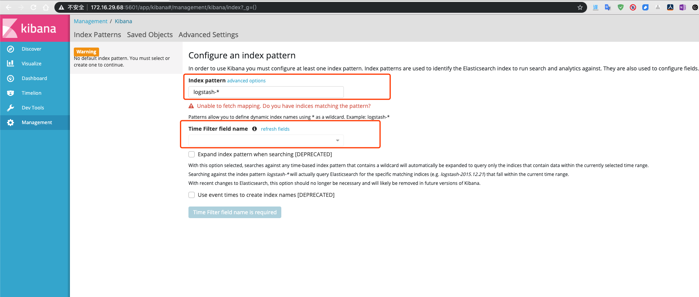
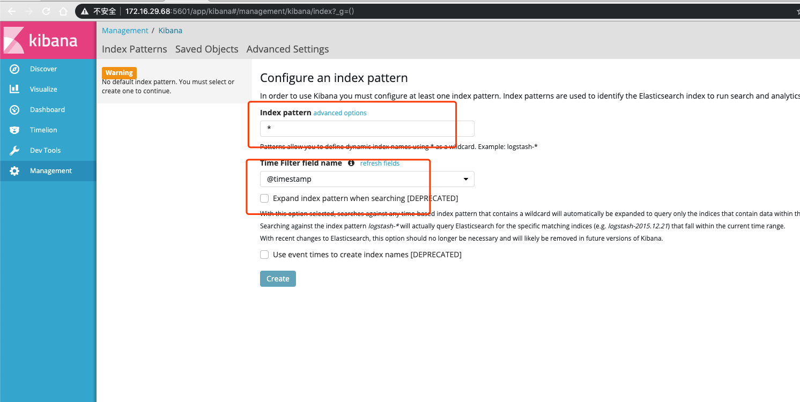
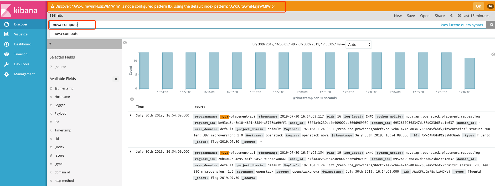

# kolla部署EFK

1. 修改globals文件

    ```yaml
    vim /etc/kolla/globals.yml
    enable_central_logging: "yes"
    ```
2. 重新部署，会自动安装EFK

    ```bash
    # 单节点
    kolla-ansible  deploy
    #多节点如下
    kolla-ansible -i ~/multinode deploy
    #也可以加tags指定，这样执行比较快
    kolla-ansible deploy --tags elasticsearch,kibana
    #fluentd 这个容器不管有没有开启EFK，都会启动，所以tags中不需要指定这个
    ```
3. 使用EFK，打开kibana界面，默认端口号是5601
    - 
    - 配置kibana，index patter选择```*```，表示所有的索引，timefilter选择时间戳，如下图
    - 
    - 之后选择discover，如下图
    - 
4. 具体的使用指导，请看Animbus6.5的user-guide。[EFK User Guide](ftp://99cloudftp@172.16.20.14/release/6.5.0/Animbus-6.5.0-EFK-User-Guide.pdf)
