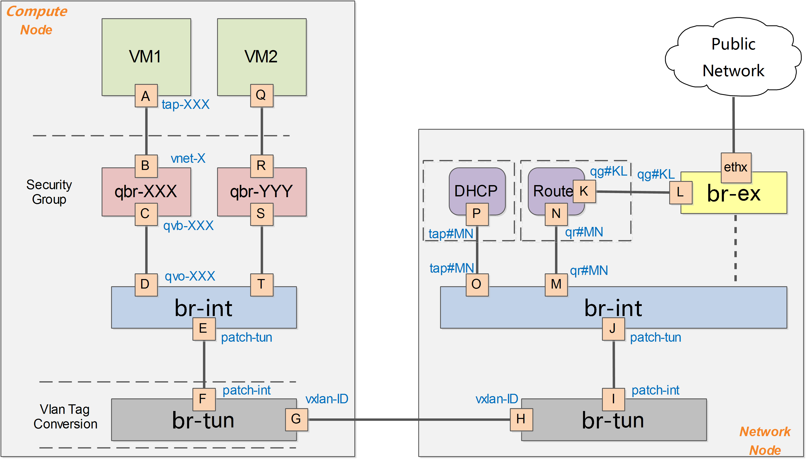

# neutron文档整理

## 介绍

1. neutron支持二层和三层的网络模型，二层也就是虚拟机之后从物理网口出去，而三层网络所有的流量必须经过网络节点。所以根据实际情况选择二层网络和三层网络模型。
2. ```neutron_server```: 用来处理neutron的所有API请求
3. ```neutron_openvswitch```: 用来下发流表以及和虚拟机相关的网络相关
4. ```neutron_metadata_agent```: 提供 instance 的配置信息（这些信息被统称为 metadata）。instance 启动时向 Metadata Service 请求并获得自己的 metadata，instance 的 cloud-init根据 metadata 完成个性化配置工作。
5. ```neutron_dhcp_agent```: 负责虚拟机DHCP的处理
6. ```neutron_l3_agent```: 负责router等三层的信息处理

## 使用二层的网络

1. 使用二层网络的时候，虚拟机的流量不经过网络节点，无法实现子网隔离，floating ip等功能。
2. 

## 使用三层的网络

1. vlan作为二层网络
    - 
    - 说明: 如果安全组使用的不是iptables，直接使用的是ovs，则上图中，没有qbr网桥。

2. vxlan作为二层网络
    - 
    - 说明: 如果安全组使用的不是iptables，直接使用的是ovs，则上图中，没有qbr网桥。

## vxlan虚拟机流量分析

1. 首先创建subnet然后绑定router之后绑定到provider网络上
2. 创建虚拟机，使用该网络。
3. 在虚拟机中ping外部网络
4. 首先来看虚拟机的物理连接情况
    - 查看到虚拟机的的tap设备

        ```bash
        (nova-libvirt)[root@openstack /]# virsh  list
         Id    Name                           State
        ----------------------------------------------------
         1     instance-00000001              running

        (nova-libvirt)[root@openstack /]# exit
        exit
        [root@openstack ~]# docker exec -it -u root nova_libvirt bash
        (nova-libvirt)[root@openstack /]# virsh  list
         Id    Name                           State
        ----------------------------------------------------
         1     instance-00000001              running
         (nova-libvirt)[root@openstack /]# virsh  edit 1
        。。。。。。 <target dev='tapa00e4249-86'/>。。。。。。
        ```
    - 找到该虚拟机的tap设备为: tapa00e4249-86
    - 执行brctl show 查看该tap设备绑定在哪儿

        ```bash
        [root@openstack ~]# brctl  show
        bridge name	bridge id		STP enabled	interfaces
        docker0		8000.02427a47c177	no
        qbra00e4249-86		8000.f622d7f3790b	no		qvba00e4249-86
        							tapa00e4249-86
        ```
    - 可以看到该tap设备绑定在了qbra00e4249-86网桥上，并且还绑定了一个qvba00e4249-86接口。
    - 之后找到veth-pair的另一端

        ```bash
        [root@openstack ~]# ip link show type veth
        14: qvoa00e4249-86@qvba00e4249-86: 。。。。。。
        15: qvba00e4249-86@qvoa00e4249-86: 。。。。。。

        [root@openstack ~]# docker exec -it -u root neutron_openvswitch_agent bash
        (neutron-openvswitch-agent)[root@openstack /]# ovs-vsctl show
        673299e2-8a66-419f-bbf2-efc425540d2e
            Manager "ptcp:6640:127.0.0.1"
                is_connected: true
            Bridge br-int
                Controller "tcp:127.0.0.1:6633"
                    is_connected: true
                fail_mode: secure
                Port "qvoa00e4249-86"
                    tag: 1
                    Interface "qvoa00e4249-86"
                Port int-br-ex
                    Interface int-br-ex
                        type: patch
                        options: {peer=phy-br-ex}
        ```
    - 可以看到一个veth pair在bridge上， 一个在br-int上。
    - 之后我们查看br-int，上面还绑定了br-ex和br-tun（allinone）

        ```bash
        Bridge br-int
            Controller "tcp:127.0.0.1:6633"
                is_connected: true
            fail_mode: secure
            Port "qvoa00e4249-86"
                tag: 1
                Interface "qvoa00e4249-86"
            Port int-br-ex   #和br-ex连接的口
                Interface int-br-ex
                    type: patch
                    options: {peer=phy-br-ex}
            Port br-int
                Interface br-int
                    type: internal
            Port patch-tun   #和br-tun连接的口
                Interface patch-tun
                    type: patch
                    options: {peer=patch-int}
        ```
    - 查看br-ex的网桥

        ```bash
        Bridge br-ex
            Controller "tcp:127.0.0.1:6633"
                is_connected: true
            fail_mode: secure
            Port br-ex
                Interface br-ex
                    type: internal
            Port phy-br-ex  #和br-int相连接的口
                Interface phy-br-ex
                    type: patch
                    options: {peer=int-br-ex}
            Port "eth1"   #和物理网口连接的口，如果走二层，那么直接从这个网口出去了
                Interface "eth1"
        ```
    - 查看br-tun的网桥（allinone）

        ```bash
        Bridge br-tun
            Controller "tcp:127.0.0.1:6633"
                is_connected: true
            fail_mode: secure
            Port patch-int  #和br-int相连的口
                Interface patch-int
                    type: patch
                    options: {peer=patch-tun}
            Port br-tun
                Interface br-tun
                    type: internal
        ```
    - 正常的多节点环境是需要建立隧道的。（这个是多节点）会把流量送到neutron节点上。

        ```bash
        Bridge br-tun
            Controller "tcp:127.0.0.1:6633"
                is_connected: true
            fail_mode: secure
            Port patch-int
                Interface patch-int
                    type: patch
                    options: {peer=patch-tun}
            Port "vxlan-0a00200f"
                Interface "vxlan-0a00200f"
                    type: vxlan
                    options: {df_default="true", in_key=flow,      local_ip="10.0.32.11", out_key=flow,   remote_ip="10.0.32.15"}
            Port br-tun
                Interface br-tun
                    type: internal
            Port "vxlan-0a00200d"
                Interface "vxlan-0a00200d"
                    type: vxlan
                    options: {df_default="true", in_key=flow,      local_ip="10.0.32.11", out_key=flow,   remote_ip="10.0.32.13"}
            Port "vxlan-0a002010"
                Interface "vxlan-0a002010"
                    type: vxlan
                    options: {df_default="true", in_key=flow,      local_ip="10.0.32.11", out_key=flow,   remote_ip="10.0.32.16"}
            Port "vxlan-0a00200e"
                Interface "vxlan-0a00200e"
                    type: vxlan
                    options: {df_default="true", in_key=flow,      local_ip="10.0.32.11", out_key=flow,   remote_ip="10.0.32.14"}
            Port "vxlan-0a00200c"
                Interface "vxlan-0a00200c"
                    type: vxlan
                    options: {df_default="true", in_key=flow,      local_ip="10.0.32.11", out_key=flow,   remote_ip="10.0.32.12"}
        ```
    - 由此可见，虚拟机的流量经过-linux bridge然后到达br-int,之后是到br-int还是br-tun，这个是由流表决定的。接下来分析虚拟机的流量分析。

## allinone分析流表处理租户网络的过程
1. 首先查看br-int的流表
    - 
2. 查看table25
    - 
3. 查看虚拟机的mac地址
    - 
4. 可以看到，只允许这个mac地址的报文通过
5. 之后查看table60
    - 
6. 由此可见，在这个地方在br-int网桥上正常转发
7. 查看br-int上的所有网口

    ```bash
    Bridge br-int
        Controller "tcp:127.0.0.1:6633"
            is_connected: true
        fail_mode: secure
        Port "qvoa00e4249-86"
            tag: 1
            Interface "qvoa00e4249-86"
        Port int-br-ex
            Interface int-br-ex
                type: patch
                options: {peer=phy-br-ex}
        Port br-int
            Interface br-int
                type: internal
        Port patch-tun
            Interface patch-tun
                type: patch
                options: {peer=patch-int}
        Port "qr-c0d4c480-14"  #这里有qr口，找到这个网口（由于是normal转发，会转发到这个上）
            tag: 1
            Interface "qr-c0d4c480-14"
    ```
8. 我们登录到router的namespace中

    ```bash
    [root@openstack ~]# ip netns
    qdhcp-ceb8d3d5-ecda-489b-82a9-514befbbc65e (id: 2)
    qrouter-56760923-3512-47ff-8619-f83901a1d770 (id: 1)
    qdhcp-2fa6953b-3784-4c35-87c1-0840ddf6e72a (id: 0)
    [root@openstack ~]# ip netns exec qrouter-56760923-3512-47ff-8619-f83901a1d770 ip a
    1: lo: <LOOPBACK,UP,LOWER_UP> mtu 65536 qdisc noqueue state UNKNOWN groupdefault       qlen 1000
        link/loopback 00:00:00:00:00:00 brd 00:00:00:00:00:00
        inet 127.0.0.1/8 scope host lo
           valid_lft forever preferred_lft forever
        inet6 ::1/128 scope host
           valid_lft forever preferred_lft forever
    10: qr-c0d4c480-14: <BROADCAST,MULTICAST,UP,LOWER_UP> mtu 1450 qdisc noqueuestate      UNKNOWN group default qlen 1000
        link/ether fa:16:3e:6b:de:55 brd ff:ff:ff:ff:ff:ff
        inet 192.168.1.1/24 brd 192.168.1.255 scope global qr-c0d4c480-14
           valid_lft forever preferred_lft forever
        inet6 fe80::f816:3eff:fe6b:de55/64 scope link
           valid_lft forever preferred_lft forever
    12: qg-c155f060-01: <BROADCAST,MULTICAST,UP,LOWER_UP> mtu 1500 qdisc noqueuestate      UNKNOWN group default qlen 1000
        link/ether fa:16:3e:da:a4:5f brd ff:ff:ff:ff:ff:ff
        inet 192.168.2.22/24 brd 192.168.2.255 scope global qg-c155f060-01
           valid_lft forever preferred_lft forever
        inet6 fe80::f816:3eff:feda:a45f/64 scope link
           valid_lft forever preferred_lft forever
    ```
9. 可以查看到br-int上绑定的qr口在router的namespace中
10. 数据包到达该qr口之后应该怎么处理，接下来我们查看iptables的规则

    ```bash
    [root@openstack ~]# ip netns exec qrouter-56760923-3512-47ff-8619-f83901a1d770 bash
    [root@openstack ~]# iptables -L -t NAT
          。。。。。。。
    Chain neutron-l3-agent-snat (1 references)
    target     prot opt source               destination
    neutron-l3-agent-float-snat  all  --  anywhere             anywhere
    SNAT       all  --  anywhere             anywhere             to:192.168.2.22
    SNAT       all  --  anywhere             anywhere             mark match ! 0x2/0xffff      ctstate DNAT to:192.168.2.22
          。。。。。。
    ```
11. 其中可以看到所有的数据包都会被SNAT 到 192.168.2.22上，而192.168.2.22就是qg-c155f060-01口的地址。192.168.2.0是我建立的provider网络，绑定在router上。
12. 接下来我们查看路由表

    ```bash
    [root@openstack ~]# ip r
    default via 192.168.2.1 dev qg-c155f060-01
    192.168.1.0/24 dev qr-c0d4c480-14 proto kernel scope link src 192.168.1.1
    192.168.2.0/24 dev qg-c155f060-01 proto kernel scope link src 192.168.2.22
    ```
13. 当数据包在nsnamespace中经过SNAT转换成192.168.2.22的时候。接下来查看192.168.2.22在哪个网桥上

    ```
    Bridge br-int
        Controller "tcp:127.0.0.1:6633"
            is_connected: true
        fail_mode: secure
        。。。。。。
        Port "qg-c155f060-01"
            tag: 2
            Interface "qg-c155f060-01"
                type: internal
        。。。。。。
    ```
14. 可以看到qg口也是绑定在br-int，接下来查看br-int收到这个数据包之后怎么处理
15. 查看转发流表
    - 
    - 可以看到，上面的匹配条件都没有，那么直接进行二层转发。会转发到br-ex
    - 
    - tag是2（见13），匹配到第一条，去掉tag之后，直接进行normal转发。最终从br-ex绑定的eth1网口出去
    - 
    - 可以看出，我们的provider就是flat网络，出口是不带vlan tag
    - 如果是vlan网络，那么流表还会在修改一次vlan tag

## 总结

- 由于手头没有network节点和计算节点分开的测试环境，所有流表分析的时候是allinone的场景，allinone的场景，直接在br-int上完成转发。
- 在网络节点和计算节点分开的场景中，实际上在br-int网桥上之后，需要到br-tun网桥上，查看这个网桥的流表，会匹配到vxlan的隧道，然后从隧道发送到网络节点上，网络节点上，在从br-tun->br-int->br-ex上。
