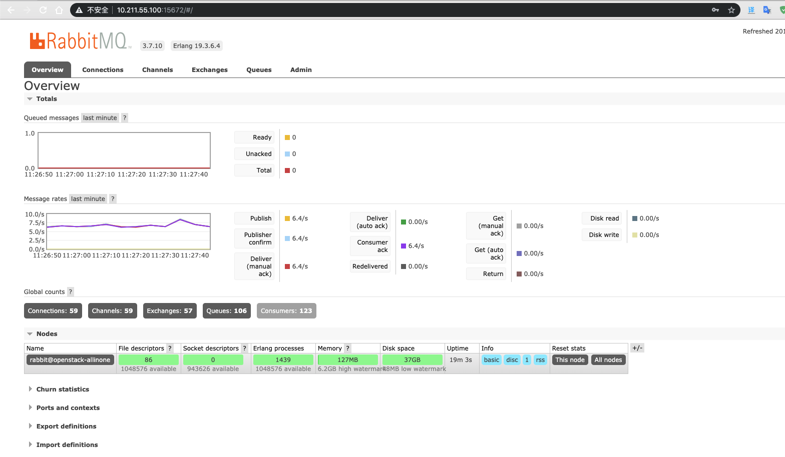

# rabbitmq运维文档

1. 进入rabbitmq容器，所有的rabbitmq命令都需要在容器中执行

    ```bash
    [root@openstack ~]# docker exec -it -u root rabbitmq bash
    ```
2. 常用命令

    ```bash
    (rabbitmq)[root@openstack /]# rabbitmqctl cluster_status
    #查看集群状态
    (rabbitmq)[root@openstack /]# rabbitmqctl node_health_check
    #检查节点状态
    (rabbitmq)[root@openstack /]# rabbitmqctl  list_users
    #查看用户
    (rabbitmq)[root@openstack /]# rabbitmqctl list_queues
    #查看queues 如果有没有被消费的，rabbitmq的健康状态为异常
    (rabbitmq)[root@openstack /]# rabbitmqctl list_exchanges
    #查看exchanges 如果exchanges丢了，则client端会报错
    (rabbitmq)[root@openstack /]# rabbitmq-plugins list
    #查看是否有rabbitmq_management插件，如果有，则可以通过网页登录
    ```
3. 登录页面进行管理
    - 获取密码

        ```bash
        [root@openstack-allinone ~]# grep ^rabbitmq_password /etc/kolla/passwords.yml

        rabbitmq_password: XqERx23709FEwzMt5WhfhvcstZUVTeqU02QgoyGt
        ```
    - 登录界面

        ```http
        http://<your vip address>:15672

        #username: openstack,password: <your rabbitmq_password>
        ```
    - 登录页面之后可以对queue，exchanges等对象进行管理
        - 界面如下图:
        - 
        - 查看queue
        - 
        - 查看queue的消费者
        - 
4. 查看rabbitmq日志
    - 如果rabbitmq出问题，那么报错都会写在日志中。
    - 日志路径

        ```bash
        tailf /var/lib/docker/volumes/kolla_logs/_data/rabbitmq/*.log
        ```
    - 解决rabbitmq的问题，不管是exchange，queues，message数据丢失，最好的解决办法就是重启
5. rabbitmq建议
    - 不要在rabbitmq节点上跑虚拟机，造成资源极度匮乏
    - 后期可以通过消息持久化来解决rabbitmq的丢数据问题，但是性能下降。
    - 绝大多数的rabbitmq问题可以通过重启来解决