# zabbix文档

## 介绍

由于zabbix不是openstack组件，属于openstack周边的功能，所以在kolla中并没有集成zabbix的部署，接下来，我会自己部署一个zabbix，并且获取ceph的健康状态值作为一个监控项，做一个zabbix demo。

## 安装配置zabbix步骤

1. 安装采用docker的方式安装zabbix
    - 获取数据库的密码信息（使用openstack的数据库）

        ```bash
        [root@openstack-allinone ~]# grep ^database /etc/kolla/passwords.yml
        database_password: yV6jOylDevAkJWoK1nJCy7CvDhzI5jHSXMZTrUyt
        ```
    - 获取数据库的vip

        ```bash
        [root@openstack-allinone ~]# grep vip /etc/kolla/globals.yml
        kolla_internal_vip_address: "10.211.55.100"
        ```
    - 部署zabbix-server

        ```bash
        docker run --name zabbix_server --network host -e DB_SERVER_HOST="10.211.55.100" -e MYSQL_USER="root" -e MYSQL_PASSWORD="yV6jOylDevAkJWoK1nJCy7CvDhzI5jHSXMZTrUyt" -d zabbix/zabbix-server-mysql:centos-latest
        #需要使用host网络模式和其他容器之间通信
        #DB_SERVER_HOST数据库地址
        #MYSQL_USER 数据库用户名
        #MYSQL_PASSWORD 数据库账户
        #这时候数据库中创建了zabbix数据库，并且生成了对应的表
        ```
    - 部署zabbix-web

        ```bash
        [root@openstack-allinone ~]# docker run --name zabbix_web  --network host -e DB_SERVER_HOST="10.211.55.100" -e MYSQL_USER="root" -e MYSQL_PASSWORD="yV6jOylDevAkJWoK1nJCy7CvDhzI5jHSXMZTrUyt" -e ZBX_SERVER_HOST="10.211.55.100" -e PHP_TZ="Asia/Shanghai" -d zabbix/zabbix-web-nginx-mysql:centos-latest
        #ZBX_SERVER_HOST 填写上面的zabbix-server地址
        #-p 是端口映射，接下来可以访问8001端口
        ```
    - 修改zabbix-web的端口（因为默认的80端口会被horizon占用）

        ```bash
        [root@openstack ~]# docker exec -it -u root zabbix_web bash
        [root@openstack zabbix]# vi /etc/nginx/conf.d/nginx.conf
                ........
        listen          8001;
                ........
        #修改为8001端口，默认是80
        [root@openstack zabbix]# exit
        [root@openstack ~]# docker restart zabbix_web
        ```
    - zabbix的登录界面如下
        - 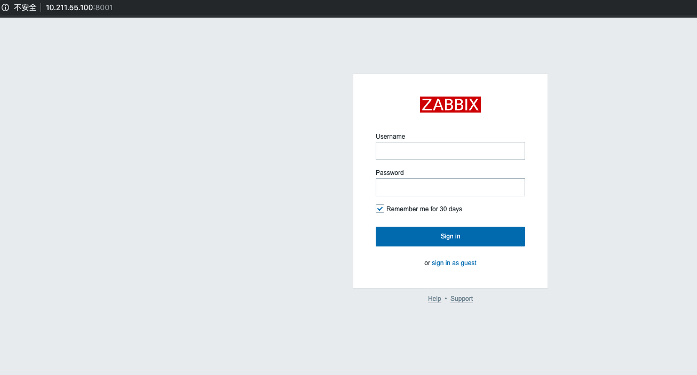
        - zabbix的默认用户是Admin，密码是zabbix
        - 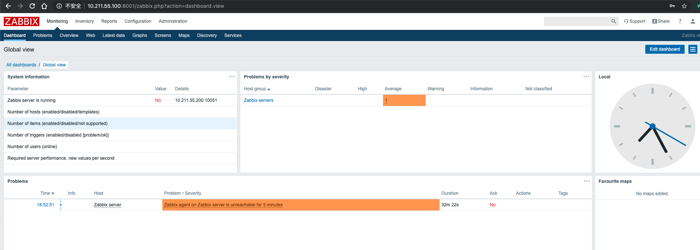
    - zabbix_agent的安装

        ```bash
        docker run --name zabbix_agent --network host -e ZBX_HOSTNAME="zabbix_test" -v /var/run:/var/run -e ZBX_SERVER_HOST="10.211.55.100" -d zabbix/zabbix-agent:centos-latest
        #其中-v /var/run挂载到容器中，是为了获取外部的docker.socket，从而和docker的daemon通信。
        ```
2. 配置zabbix_web
    - 登录zabbix_web
    - 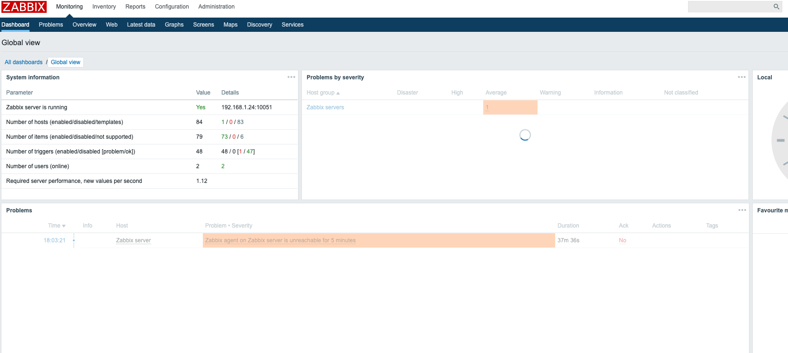
    - 创建host（configuration->hosts）
    - 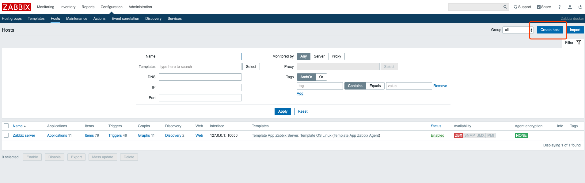
    - 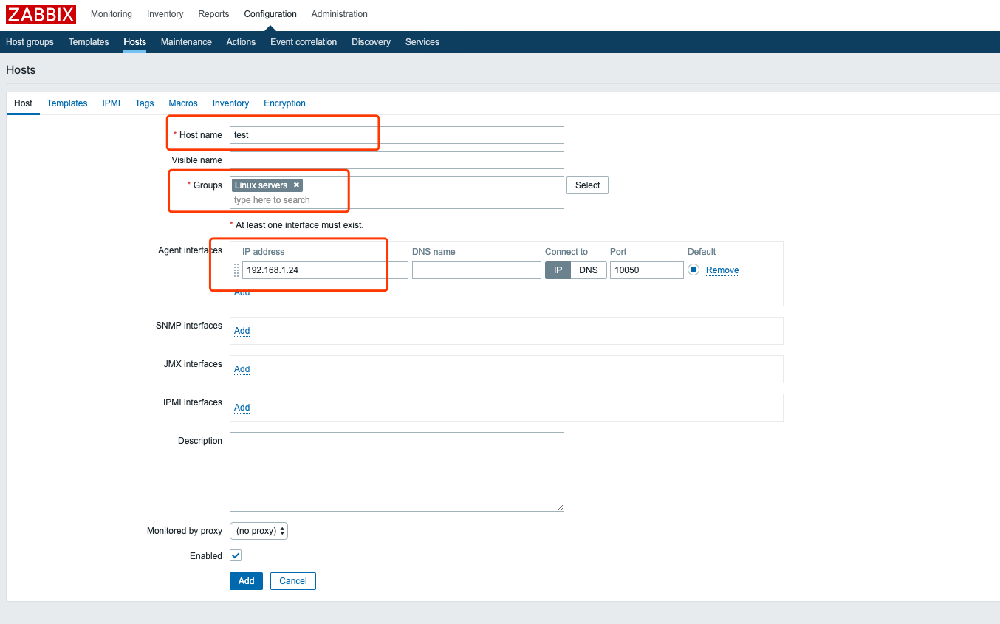
    - 之后自动跳转到configuration-Hosts界面
    - 禁止默认的监控项（点击绿的enable变成disable即可）
    - 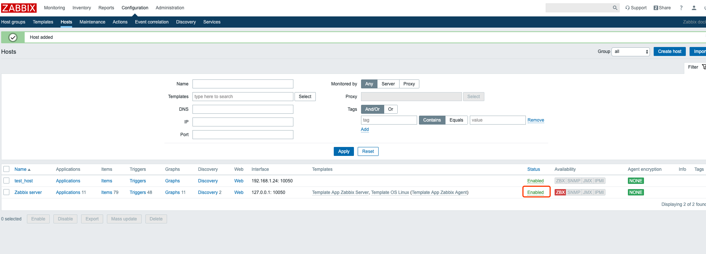
    - 配置template，依次点击configuration->templates->create template
    - 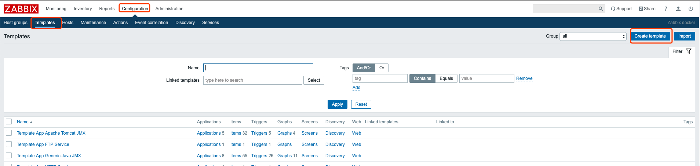
    - 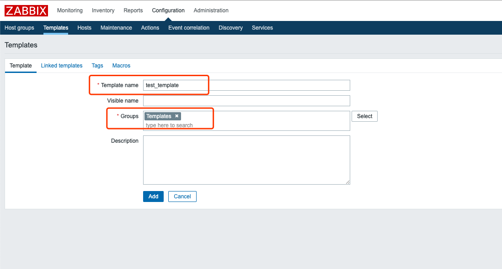
    - 之后选中刚创建的template，步骤如下
    - 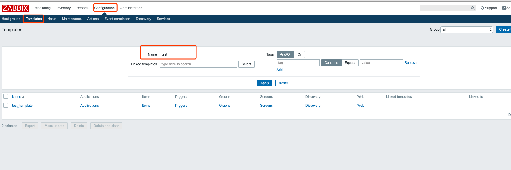
    - 之后需要新建item
    - 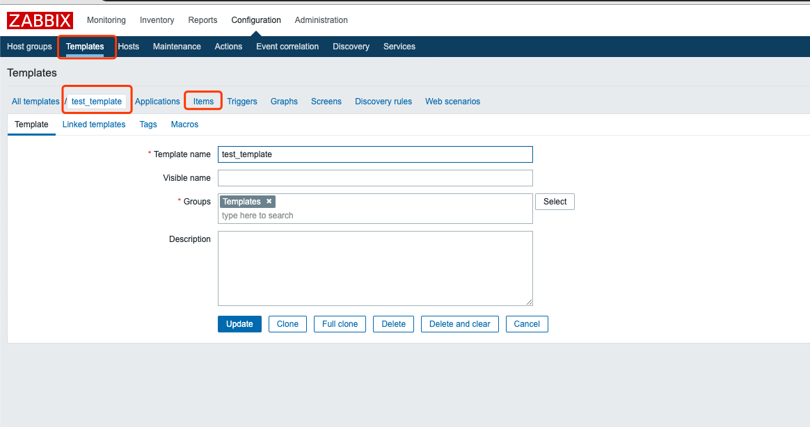
    - 之后选择右上角，新建item，并填写如下内容
    - 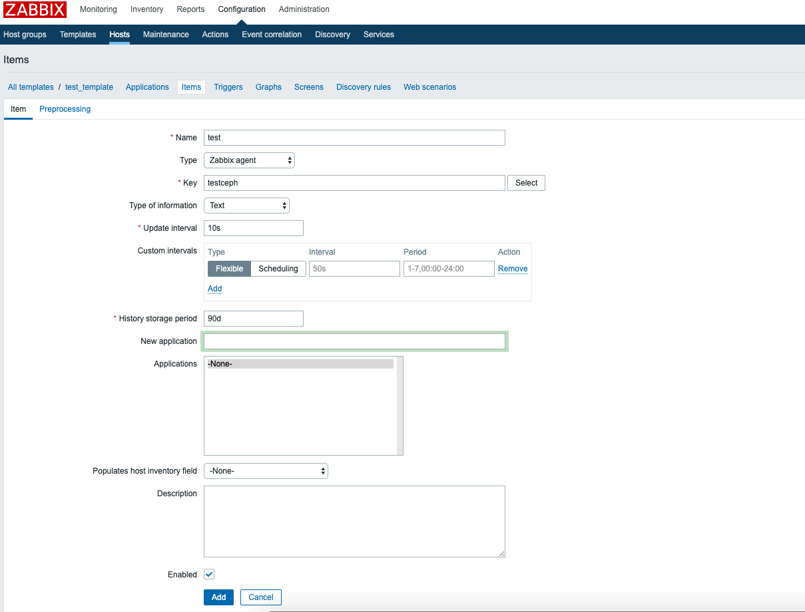
    - 上一步中key的值，需要和等会创建的zabbix_agent里面的值对应，Type of information是返回值类型，Update interval是监控间隔。
    - 之后创建Triggers
    - 选中到triggers之后，选择创建triggers，内容如下图
    - 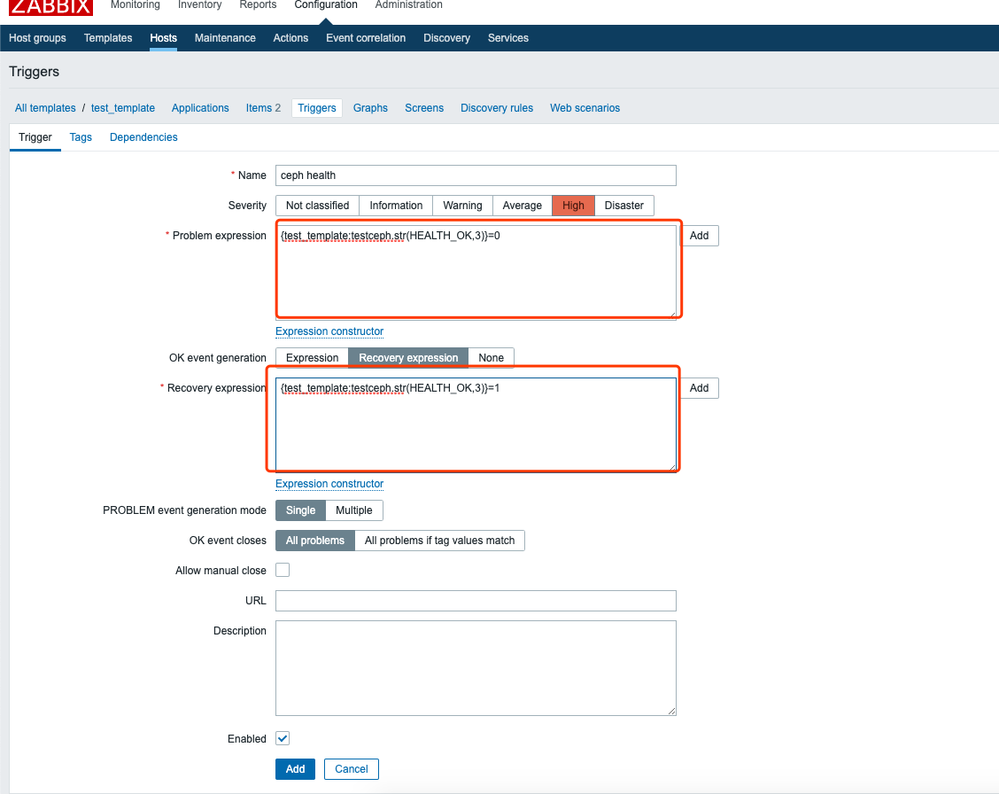
    - 之后关联host到template上
    - configuration->hosts->（主机名）->templates->选中template之后要执行add操作。
    - 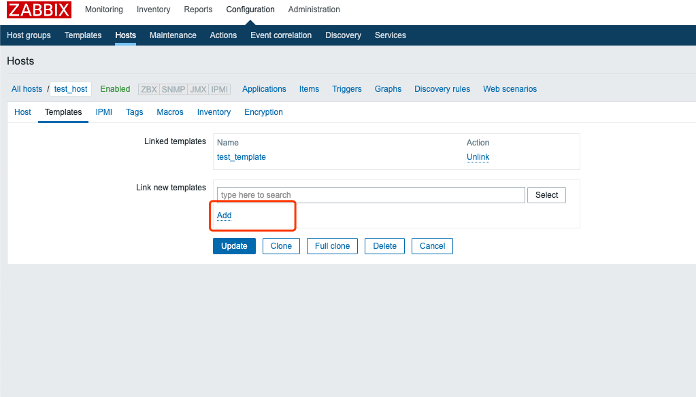
3. 配置zabbix_agent
    - 由于我们的ceph是在ceph_mon容器中，所以容器中需要安装docker

        ```bash
        [root@openstack ~]# docker exec -it -u root zabbix_agent bash
        [root@openstack zabbix]# yum install docker -y
        [root@openstack zabbix]# yum install sudo -y
        [root@openstack zabbix]# sudoedit /etc/sudoers
                   。。。。。。#文件最后
        zabbix ALL=(ALL) NOPASSWD: /usr/bin/docker
                   。。。。。。
        [root@openstack zabbix]# vi /etc/zabbix/zabbix_agentd.conf
        AllowRoot=1  #默认是0
        ser=root  #zabbix
        ```
    - 创建zabbix配置文件

        ```bash
        vi /etc/zabbix/zabbix_agentd.d/ceph_health.conf
        #内容如下
        UserParameter=testceph,sudo docker exec ceph_mon ceph -s | grep health | awk  '{print $2}'
        #如果要传入参数，则testceph这个key应该写成testceph[*],之后使用$1,$2去依次取列表里的参数，同时在web上把参数传入给这个testceph这个key,最后章节介绍
        ```
    - 配置文件如下
    - 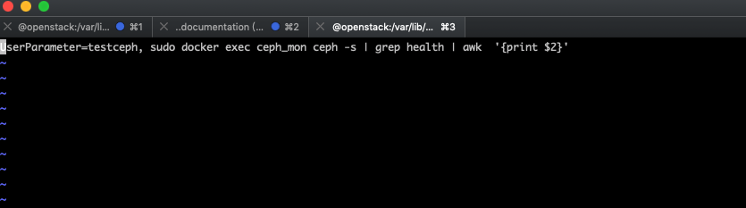
    - 之后重启zabbix_agent容器

        ```
        [root@openstack ~]# docker restart zabbix_agent
        ```

## 查看监控项

1. 登录web(略)
2. 我们手动停掉一个ceph_osd，然后查看zabbix是否会告警

    ```bash
    root@openstack ~]# docker stop ceph_osd_0
    ```
3. 之后我们登录到zabbix，查看monitoring->dashboard，如下图
4. 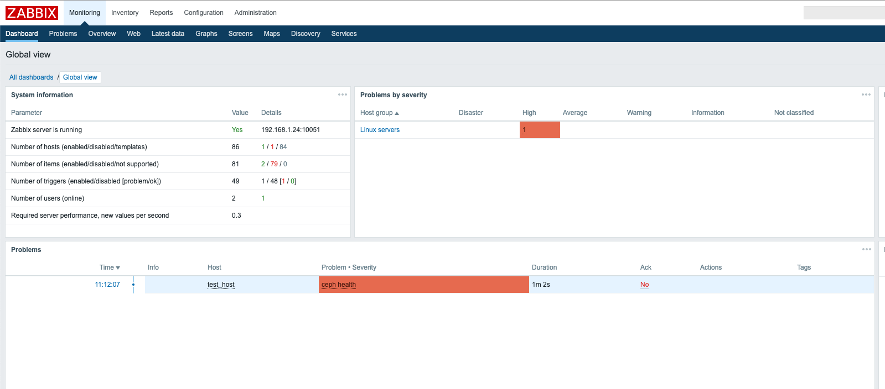
5. 下面我们手动启动该ceph osd，查看告警是否会消息。

    ```
    root@openstack ~]# docker start ceph_osd_0
    ```
6. 之后查看problem的页签中，结果如下图，已经恢复。
7. 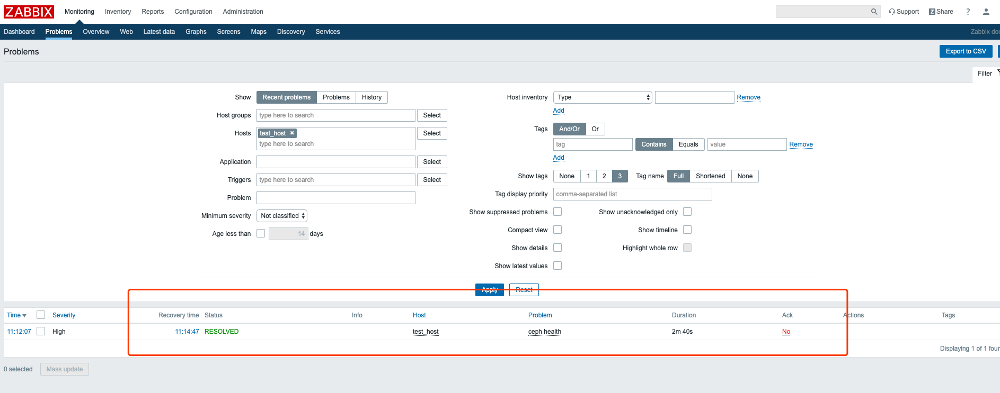

## 创建一个可以传递参数的item

1. 选择到template->create items中
2. 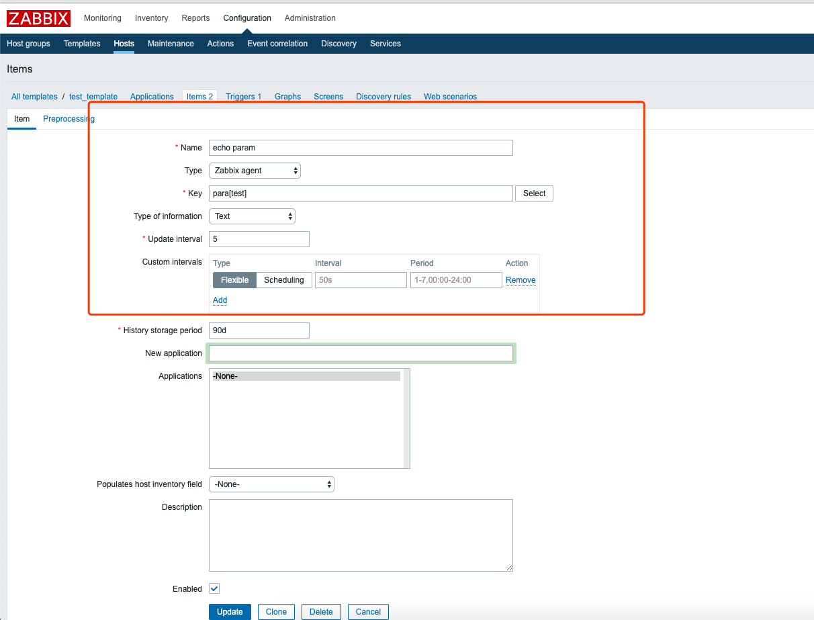
3. 之后编辑zabbix_agent的容器中的配置文件，添加一行，如下图
4. 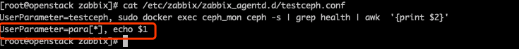
5. 查看页面显示情况
6. 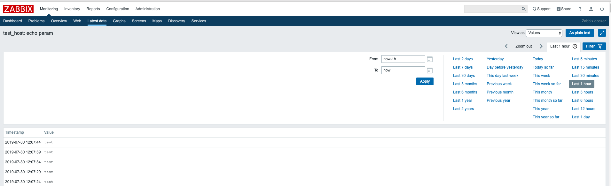